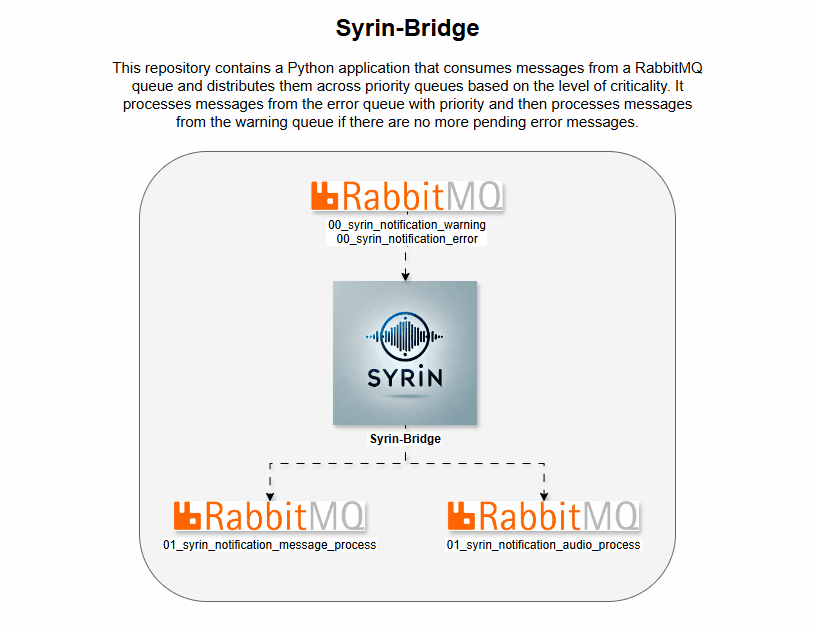

# syrin-bridge

This script, `syrin-bridge`, connects to RabbitMQ, ensures the necessary queues are created, and processes messages with a priority order.

## Demo

## Table of Contents
- [Installation](#installation)
- [Environment Variables](#environment-variables)
- [Functionality](#functionality)
- [Queue Declarations](#queue-declarations)
- [Logging](#logging)
- [License](#license)

## Installation

Ensure that RabbitMQ is configured and accessible. For full installation details, refer to the [SYRIN Installation Repository](https://github.com/syrin-alert/syrin-install).

## Environment Variables

Set the following environment variables for RabbitMQ connection:

- `RABBITMQ_HOST`: RabbitMQ server address.
- `RABBITMQ_PORT`: Port for RabbitMQ server (default: `5672`).
- `RABBITMQ_VHOST`: Virtual host in RabbitMQ.
- `RABBITMQ_USER`: Username for RabbitMQ authentication.
- `RABBITMQ_PASS`: Password for RabbitMQ authentication.

## Functionality

This script performs the following tasks:

1. Connects to RabbitMQ with credentials from environment variables.
2. Ensures that queues required for message processing exist.
3. Continuously consumes messages with priority given to the error queue.
4. Distributes messages to specific queues based on message type.

### Queue Declarations

The following queues are managed in RabbitMQ:

- `01_syrin_notification_audio_process`: For audio-related notifications.
- `01_syrin_notification_message_process`: For general message notifications.
- `02_syrin_notification_message_process_humanized`: For humanized message processing.

Priority is given to messages in `00_syrin_notification_critical` over `00_syrin_notification_warning`.

## Logging

Logging is set at the INFO level with `pika` logs set to WARNING for reduced verbosity.

## License

This project is licensed under the MIT License.
