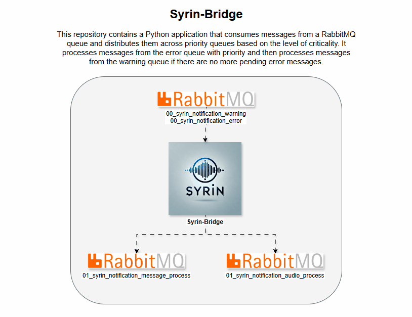

# syrin-bridge

Este script, `syrin-bridge`, conecta-se ao RabbitMQ, garante que as filas necessárias sejam criadas e processa mensagens com ordem de prioridade.

## Demo

## Tabela de Conteúdos
- [Instalação](#instalação)
- [Variáveis de Ambiente](#variáveis-de-ambiente)
- [Funcionalidade](#funcionalidade)
- [Declarações de Filas](#declarações-de-filas)
- [Logs](#logs)
- [Licença](#licença)

## Instalação

Certifique-se de que o RabbitMQ esteja configurado e acessível. Para detalhes completos de instalação, consulte o [Repositório de Instalação do SYRIN](https://github.com/syrin-alert/syrin-install).

## Variáveis de Ambiente

Defina as seguintes variáveis de ambiente para a conexão com o RabbitMQ:

- `RABBITMQ_HOST`: Endereço do servidor RabbitMQ.
- `RABBITMQ_PORT`: Porta para o servidor RabbitMQ (padrão: `5672`).
- `RABBITMQ_VHOST`: Virtual host no RabbitMQ.
- `RABBITMQ_USER`: Nome de usuário para autenticação no RabbitMQ.
- `RABBITMQ_PASS`: Senha para autenticação no RabbitMQ.

## Funcionalidade

Este script executa as seguintes tarefas:

1. Conecta-se ao RabbitMQ com credenciais das variáveis de ambiente.
2. Garante que as filas necessárias para o processamento de mensagens existam.
3. Consome mensagens continuamente, priorizando a fila de erros.
4. Distribui mensagens para filas específicas com base no tipo de mensagem.

### Declarações de Filas

As seguintes filas são gerenciadas no RabbitMQ:

- `01_syrin_notification_audio_process`: Para notificações relacionadas a áudio.
- `01_syrin_notification_message_process`: Para notificações de mensagens gerais.
- `02_syrin_notification_message_process_humanized`: Para processamento de mensagens humanizadas.

A prioridade é dada às mensagens em `00_syrin_notification_error` sobre `00_syrin_notification_warning`.

## Logs

Os logs estão configurados no nível INFO e os logs da biblioteca `pika` são definidos para WARNING para reduzir a verbosidade.

## Licença

Este projeto está licenciado sob a Licença MIT.
